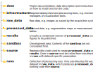

# Image Processing and Analysis Project Template
Modern research projects are expected to adhere to the [FAIR principles](https://www.go-fair.org/fair-principles/) — being **F**indable, **A**ccessible, **I**nteroperable, and **R**eusable. As described in the original article by [Wilkinson et al.](https://www.nature.com/articles/sdata201618), these principles are designed to apply not only to "data" in the conventional sense but also to the algorithms, tools, and workflows that generate that data. Increasingly, funding agencies and publishers require research to comply with these FAIR principles. Numerous initiatives supporting FAIR research provide a range of specifications, tools, and implementations to aid in this process \[[ARC](https://zenodo.org/records/11580971), [ro-crate](https://www.researchobject.org/ro-crate/), [eosc-life](https://www.embopress.org/doi/full/10.15252/embj.2023115008)\].

However, adopting these specifications or implementing the recommended practices is often time-consuming, and the benefits of investing this effort upfront may not always be immediately clear — particularly when research projects originate from spontaneous ideas, as frequently occurs. A more pragmatic approach, and one commonly chosen by researchers, is to track their research progress using tools readily available to them. For wet-lab work, this might involve maintaining an electronic lab notebook, while for data processing (e.g., image processing and analysis), it often means managing multiple versions of scripts within a complex folder structure, stored alongside the research data. Ultimately, the process relies heavily on the researcher's ability to document and track processing steps, derived data, and final results. As a result, each researcher develops a unique research environment that evolves organically to fit their specific needs. However, this often leads to an entanglement between pipeline development and execution, which can compromise reproducibility. Therefore, it is paramount to distinguish between development and execution. During development, flexibility and rapid iteration are key priorities, while the final processing steps should be implemented as parameterized routines, ready to be applied across different datasets to produce consistent, reproducible results.

As a facility and service provider for image processing and analysis in a fast-paced research environment, we support various research groups and a wide range of projects, each progressing at different speeds and with constantly shifting priorities. In such a setting, it is crucial to have a reliable project structure that remains consistent across all projects and phases. This consistency allows users, developers, supervisors, and reviewers to easily switch between different projects and focus on the scientific challenges, rather than on the organization of files.

<figure markdown="span">
    
    <figcaption>Overview of the IPA project structure. Everything related to your project is located within the __example-project__ directory.</figcaption>
</figure>

The above figure outlines the underlying directory structure of our Research Project Template. With a single command, one can copy and initialize the [template](https://fmi-faim.github.io/ipa-project-template/index.html), streamlining the project setup from the start. By adopting this template, both individual researchers and collaborative teams can save significant time, as it organizes data and software in a way that supports growth in size and complexity without sacrificing clarity. Rather than imposing rigid structures on programming, data collection, or analysis, our template fosters safer and more transparent project development. This flexibility is vital, given that the final shape of a research project often remains uncertain until later stages. Moreover, our template ensures a seamless transition from development to production and eventually publication.

Although our current implementation focuses on image processing and analysis with Python, it does not restrict the use of other programming languages or tools. Additionally, our template does not incorporate or enforce any ontologies, aiming to minimize the effort required to adopt it while providing a structured approach to organizing research code. The simple structure of our template allows for customization by research organizations or funding agencies, permitting them to e.g. add custom metadata, specific licenses, or pre-populate environment-specific settings. We view our Research Project Template as an entry point to FAIR project organization accessible to everyone.
