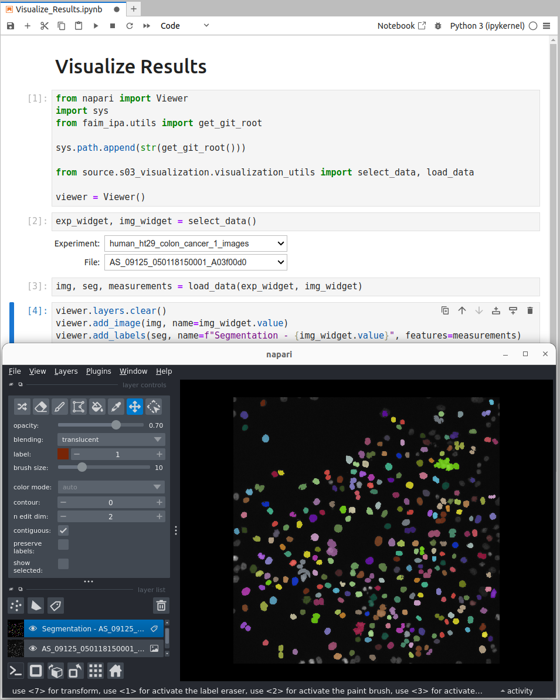

# Step-by-Step Processing
The image processing and analysis steps can be executed one-by-one. We will demonstrate this on the `raw_data/BBBC01` dataset.

## Build Config
The first step is to build the config file. To this end you must run the following command:
```bash
WD=runs/BBBC01 pixi run build_config
```

!!! info "Environment Variable `WD`"
    The `WD` variable is used to specify the working directory. This is where the config file will be stored. Check the `runs` directory for the newly created `BBBC01` directory containing the `acquisition_config.yaml` file.

You will be asked a series of questions. Select the following answers:

- __`Select the raw_data dir:`__ `/path/to/example-project/raw_data/BBBC001_v1_images_tif/human_ht29_colon_cancer_1_images/`
- __`Enter the suffix of the files to process:`__ `.tif`
- __`Select the output dir:`__ `/path/to/example-project/processed_data`

!!! tip "Edit Config"
    You can edit the config file with your favorite text edtior or re-run the `pixi run build_config` command to change the answers.

Next to the `acquisition_config.yaml` file you will find the `githash.log` file. This file contains a history of the executed pixi commands and the git hash of the project at the time of execution.

## Run Segmentation
The first processing step is to segment the nuclei. To this end you must run the following command:
```bash
WD=runs/BBBC01 pixi run segment
```

This will execute the first processing step and produce the following outputs:

* __`processed_data/human_ht29_colon_cancer_1_images/s01_segmentation`__ contains the segmented nuclei images.
* __`runs/BBBC01/measure_config.yaml`__ is the configuration file for the next processing step.
* __`runs/BBBC01/<time-stamp>-segmentation.log`__ contains the log of the segmentation step.

## Extract Measurements
The second processing step is to extract measurements from the segmented nuclei. To this end you must run the following command:
```bash
WD=runs/BBBC01 pixi run measure
```

This will execute the second processing step and produce the following outputs:

* __`processed_data/human_ht29_colon_cancer_1_images/s02_measurement`__ contains the extracted measurement csv files.
* __`runs/BBBC01/<time-stamp>-measurement.log`__ contains the log of the measurement step.
* __`runs/BBBC01/measure_outputs.yaml`__ contains a list of the measurement csv files.

## Visualize Results
The final step is to visualize the results. To this end you must run the following command:
```bash
WD=runs/BBBC01 pixi run visualize
```

In the jupyter notebook that opens you can select the experiment and image to visualize. The notebook will display the original image, the segmented nuclei, and the extracted measurements in napari.

<figure markdown="span">
    
    <figcaption>A jupyter notebook with IPython Widgets to select experiment and image, which are then displayed in napari.</figcaption>
</figure>
