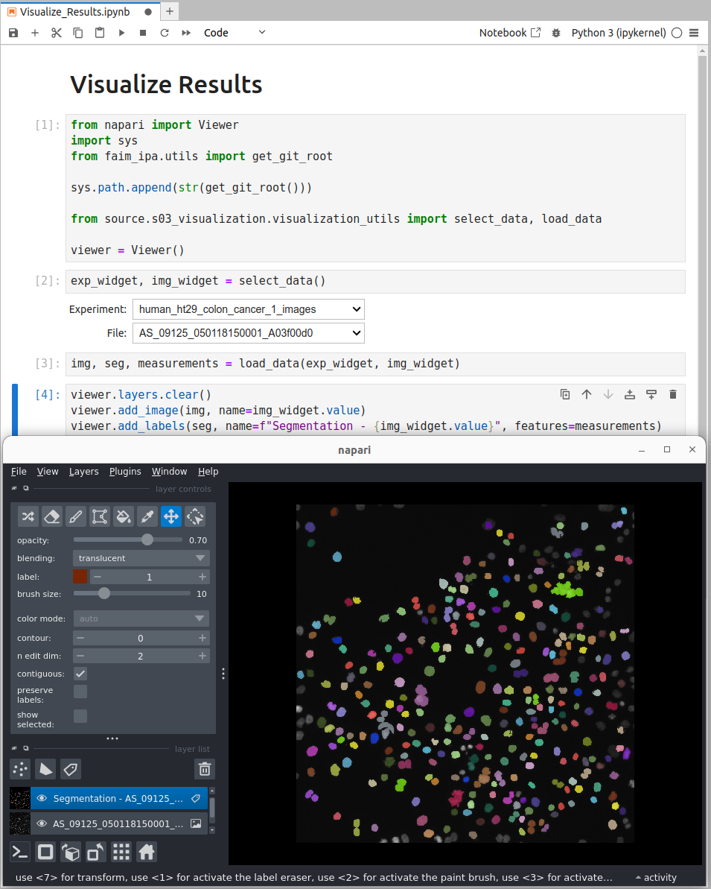

# Nextflow Workflow
If you have access to a Linux or Mac-OS machine you can use nextflow to run the processing steps automatically. We will demonstrate this on the `raw_data/BBBC02` dataset.

## Build Config
The first step is to build the config file. To this end you must run the following command:
```bash
WD=runs/BBBC02 pixi run build_config
```

You will be asked a series of questions. Select the following answers:

- __`Select the raw_data dir:`__ `/path/to/example-project/raw_data/BBBC002_v1_images/drosophila_kc167_1_images/`
- __`Enter the suffix of the files to process:`__ `.TIF`
- __`Select the output dir:`__ `/path/to/example-project/processed_data`

## Run Workflow
The next step is to run the nextflow workflow. To this end you must run the following command:
```bash
WD=runs/BBBC02 pixi run nextflow
```

The workflow will execute `s01_segment` followed by `s02_measure` and write the outputs to `processed_data/drosophila_kc167_1_images/s01_segment` and `processed_data/drosophila_kc167_1_images/s02_measurements` respectively.

!!! info "Nextflow Execution"
    The nextflow workflow is executed in the `WD` directory and nextflow will create a `.nextflow` and `work` directory, which are used by nextflow to manage the workflow execution. A detailed nextflow log file is written to `runs/BBBC02/.nextflow.log`.

## Visualize Results
The final step is to visualize the results. To this end you must run the following command:
```bash
WD=runs/BBBC02 pixi run visualize
```

In the jupyter notebook that opens you can select the experiment and image to visualize. The notebook will display the original image, the segmented nuclei, and the extracted measurements in napari.

<figure markdown="span">
    
    <figcaption>A jupyter notebook with IPython Widgets to select experiment and image, which are then displayed in napari.</figcaption>
</figure>
